[](https://github.com/eugenelet/NeuralScale-Private/blob/master/LICENSE)


# NeuralScale: Efficient Scaling of Neurons for Resource-Constrained Deep Neural Networks

This repository is the original implementation and contains required scripts to reproduce results from our paper [**NeuralScale: Efficient Scaling of Neurons for Resource-Constrained Deep Neural Networks**](http://openaccess.thecvf.com/content_CVPR_2020/papers/Lee_NeuralScale_Efficient_Scaling_of_Neurons_for_Resource-Constrained_Deep_Neural_Networks_CVPR_2020_paper.pdf) that has been accepted to *CVPR 2020 (oral)*.<br>
Authors: [Eugene Lee](eugenelet.github.io) and [Chen-Yi Lee](http://www.si2lab.org/faculty)

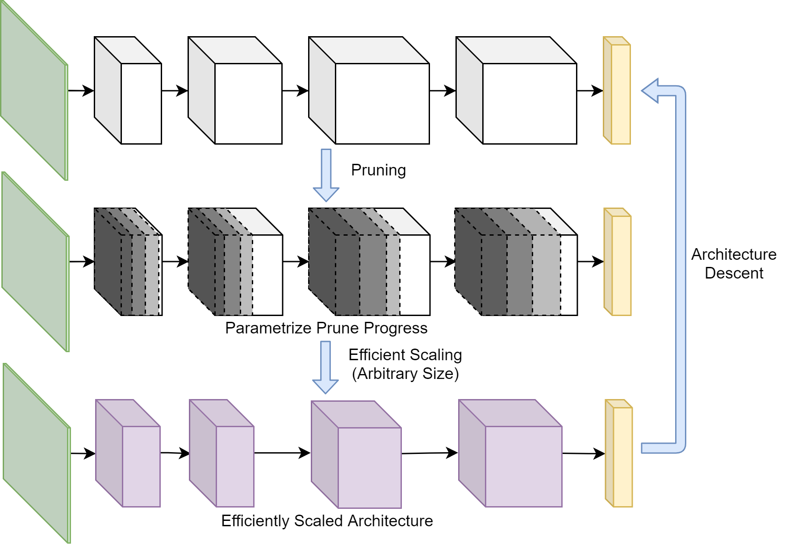

## Installation

Clone this repo.
```bash
git clone https://github.com/eugenelet/NeuralScale.git
cd NeuralScale/
```


All experiments are run on a single NVIDIA GTX1080Ti GPU.


The code was tested with python3.6 the following software versions:

| Software        | version | 
| ------------- |-------------| 
| cuDNN         | v7500 |
| Pytorch      | 1.0.1.post2  |
| CUDA | v10.0    |


## Preparation

### Dataset preparation

Data for CIFAR10 and CIFAR100 will be automatically downloaded upon the execution of scripts that require it.

Examples that runs on TinyImageNet requires a manual download from [here](https://tiny-imagenet.herokuapp.com/).

Prepare dataset by running the script below: ([source](https://github.com/tjmoon0104/pytorch-tiny-imagenet/blob/master/run.sh))
```
unzip tiny-imagenet-200.zip
rm -r ./tiny-imagenet-200/test
python3 val_format.py
```
Edit directory locations in `val_format.py` in accordance on where TinyImageNet is stored in your system.


## Examples

Models with their accompanied datasets to run:

| Models        | Dataset | 
| ------------- |-------------| 
| VGG11         | CIFAR10, CIFAR100 |
| ResNet18      | CIFAR10, CIFAR100, TinyImageNet  |
| MobileNetV2   | CIFAR10, CIFAR100, TinyImageNet  |


All examples below are based on VGG11 using CIFAR100 and MobileNetV2 using TinyImageNet respectively.

### Empirical Simulation for NeuralScale

#### Architecture Descent

To search for configuration using architecture descent, run
```
python3 architecture_descent.py --model vgg --dataset CIFAR100 --save filename
```
```
python3 imagenet_architecture_descent.py --model mobilenetv2 --dataset tinyimagenet --save filename
```

To prune (using Taylor-FO) until 50% of total filters are remaining, run (for comparison with MorphNet)
```
python3 architecture_descent.py --model vgg --dataset CIFAR100 --save filename --morph
```
```
python3 imagenet_architecture_descent.py --model mobilenetv2 --dataset tinyimagenet --save filename --morph
```

#### Train From Scratch

To train from scratch using the searched configurations using different scaling ratios, run
```
python3 ratio_swipe.py --model vgg --dataset CIFAR100 --prune_fname filename --save save_filename_0
```
```
python3 imagenet_ratio_swipe.py --model mobilenetv2 --dataset tinyimagenet --prune_fname filename --save save_filename_0
```
Note that the number at the end (`save_filename_X`) is helpful for obtaining the mean across several simulations. In our experiments `X` ranges from 0 to 4.

To train a model with configuration found using MorphNet that uses Taylor-FO as a pruning method, run
```
python3 ratio_swipe.py --model vgg --dataset CIFAR100 --morph --save save_filename_0
```
```
python3 imagenet_ratio_swipe.py --model mobilenetv2 --dataset tinyimagenet --morph --save save_filename_0
```
If a new configuration is found, changes has to be done manually by editing the file `ratio_swipe.py` or `imagenet_ratio_swipe.py`. Overwrite the configuration found right after the variable `pruned_filters` for the corresponding Model-Dataset pair.

#### Plot Results

To plot trained results, run
```
python3 plot_ratio.py --model vgg --dataset CIFAR100
```
Before running, edit the filename in accordance to the filename you saved. It's advisable to run for 5 independent simulations to get a fair comparison. Simulations based on other scaling methods are stored in this repository in the directory `saved_plots/model_name` where `model_name` can be `vgg`, `resnet18` or `mobilenetv2` depending on the desired model. Using VGG11 on CIFAR100 as an example, the plots are stored as follows (default):

| Scaling Method        | Filename | 
| ------------- |-------------| 
| Uniform Scaling (Baseline)         | ./saved_plots/resnet18/vgg_uni_c100_[0~4] |
| Pruning based on weight magnitude      | ./saved_plots/resnet18/vgg_norm_c100_[0~4]  |
| MorphNet (Taylor-FO)      | ./saved_plots/resnet18/vgg_pruned_c100_[0~4]  |
| NeuralScale (Iteration = 1)   | ./saved_plots/resnet18/vgg_10_eff_c100_early_[0~4]  |
| NeuralScale (Iteration = 15)   | ./saved_plots/resnet18/vgg_10_eff_c100_late_[0~4]  |

Below are accuracies obtained using different methods:

<table style="border:1px solid black;margin-left:auto;margin-right:auto;">
 <tr>
    <td style="text-align:center">VGG11-CIFAR10</td>
    <td style="text-align:center">VGG11-CIFAR100</td>
 </tr>
 <tr>
    <td>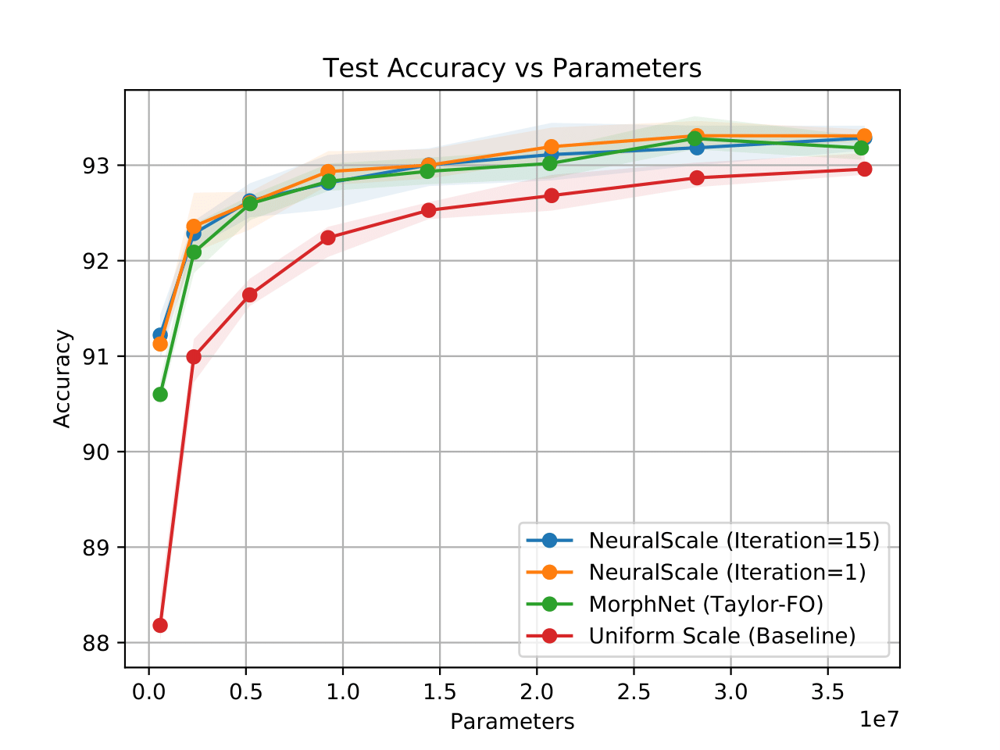</td>
    <td>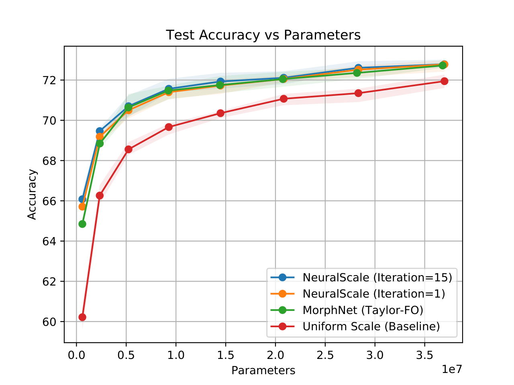</td>
 </tr>
 <tr>
    <td style="text-align:center">MobileNetV2-CIFAR100</td>
    <td style="text-align:center">MobileNetV2-TinyImageNet</td>
 </tr>
 <tr>
    <td>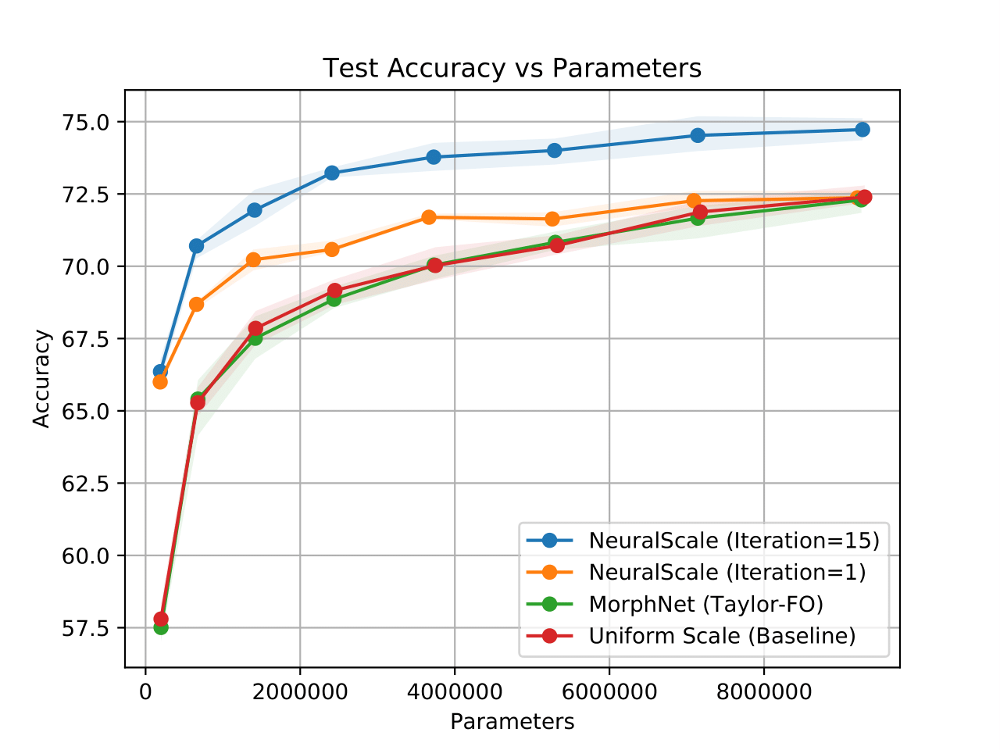</td>
    <td>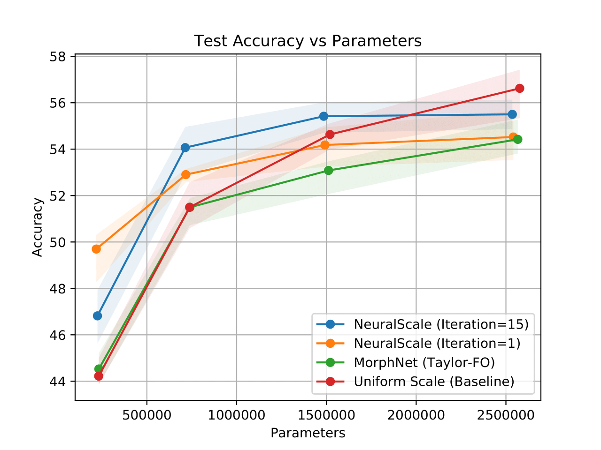</td>
 </tr>
 <tr>
    <td style="text-align:center">ResNet18-CIFAR100</td>
    <td style="text-align:center">ResNet18-TinyImageNet</td>
 </tr>
 <tr>
    <td>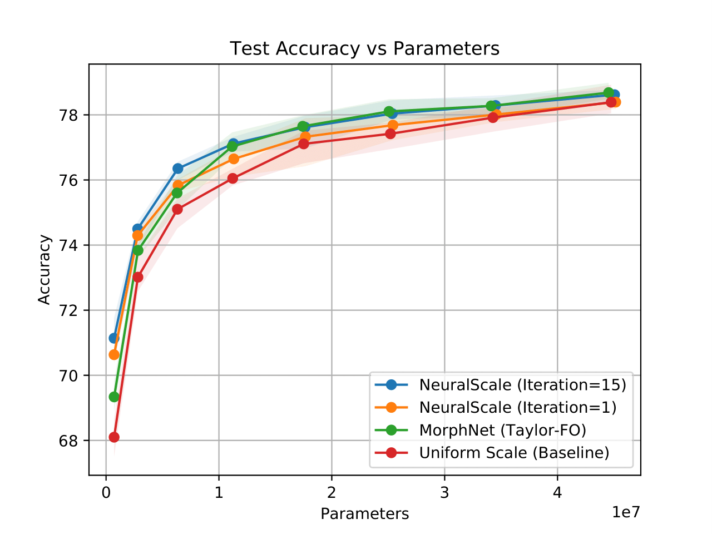</td>
    <td>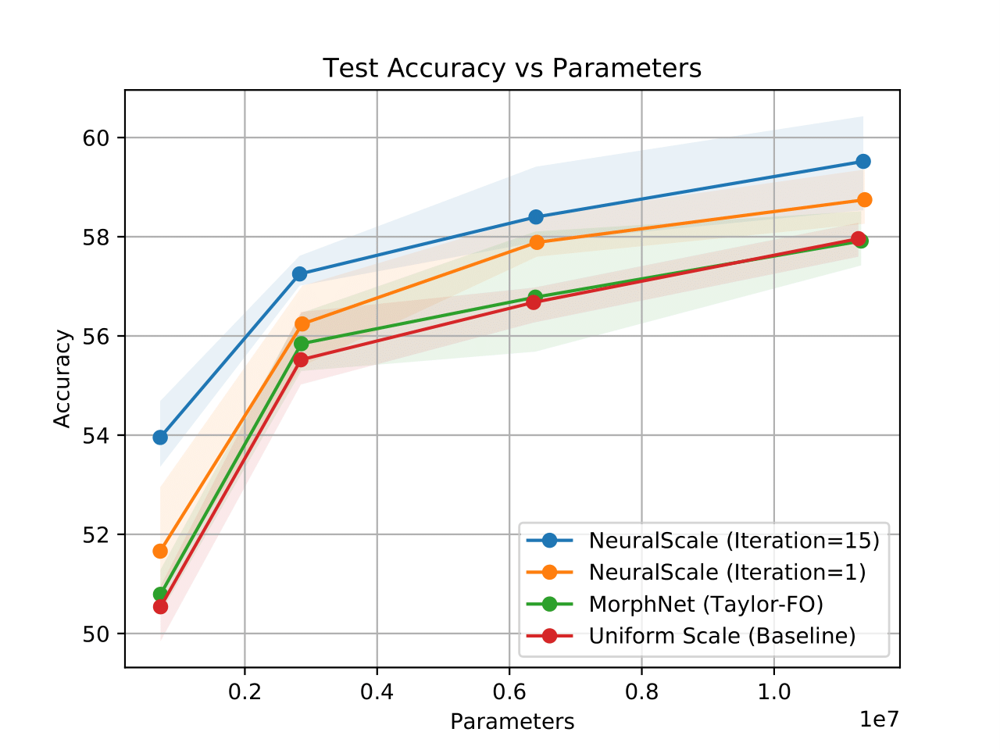</td>
 </tr>
</table>

To show results that compare with the usage of convolutional shortcut instead of identity shortcut found in the supplementary section, run
```
python3 plot_ratio_warmup.py --model mobilenetv2 --dataset CIFAR100
```

#### Simulations for Magnitude Pruning
   
`Pruning based on weight magnitude` is prepared by first running
```
python3 train_norm.py --model vgg --dataset CIFAR100 --save vgg_standard_c100
```
and is proceeded with
```
python3 fine_tune.py --model vgg --dataset CIFAR100 --prune_fname vgg_standard_c100 --save vgg_norm_c100_0
```
Results obtained via fine-tuning can be listed by running
```
python3 plot_ratio_finetune.py --model vgg --dataset CIFAR100
```

#### Plotting Results for Different Warm-up Epochs

Empirical results on using different warm-up epochs before pruning can be plotted using (for MobileNetV2 on CIFAR100)
```
python3 plot_ratio_warmup.py --model mobilenetv2 --dataset CIFAR100
```

#### Plotting Results of Architecture Descent

To show configuration obtained using architecture descent, run
```
python3 list_architecture.py --model vgg --dataset CIFAR100 --prune_fname filename
```
where `filename` should match the one specified for `architecture_descent.py` above.

Below are examples of configuration found using architecture descent:

| Model | Dataset | Configuration |
| ----- | ------- | ------------- |
| VGG11 | CIFAR10 | 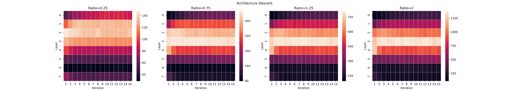 |
| VGG11 | CIFAR100 | 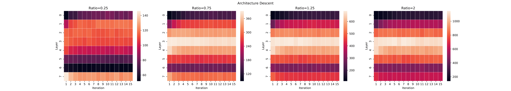 |
| MobileNetV2 | CIFAR100 | 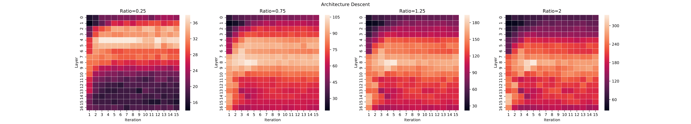 |
| MobileNetV2 | TinyImageNet | 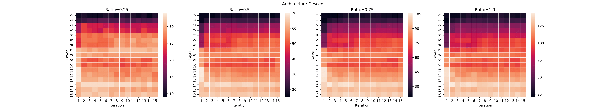 |
| ResNet18 | CIFAR100 | 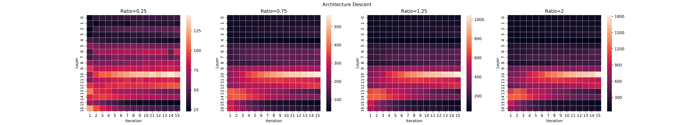 |
| ResNet18 | TinyImageNet | 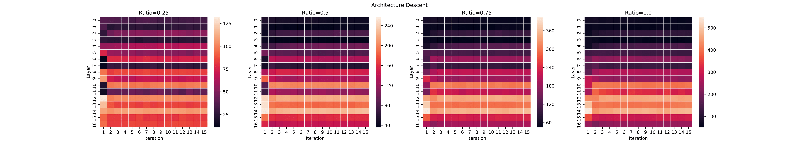 |


#### Plotting Residual Filters of Iterative Pruning

To show residual filters obtained via iterative pruning, run
```
python3 plot_filters.py --model vgg --dataset CIFAR100 --prune_fname filename
```

Below is an example for VGG11 using CIFAR10 and CIFAR100:


<table style="border:1px solid black;margin-left:auto;margin-right:auto;">
 <tr>
    <td style="text-align:center">VGG11-CIFAR10</td>
    <td style="text-align:center">VGG11-CIFAR100</td>
 </tr>
 <tr>
    <td>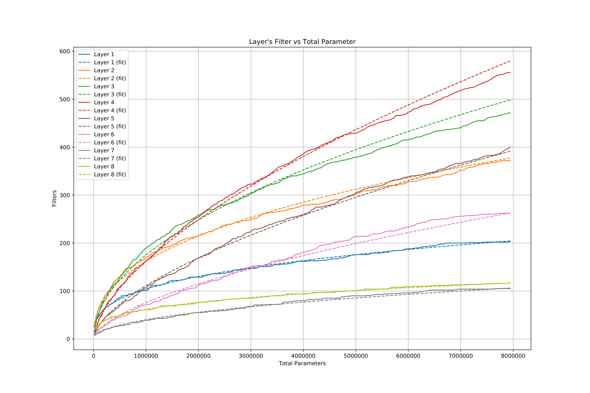</td>
    <td>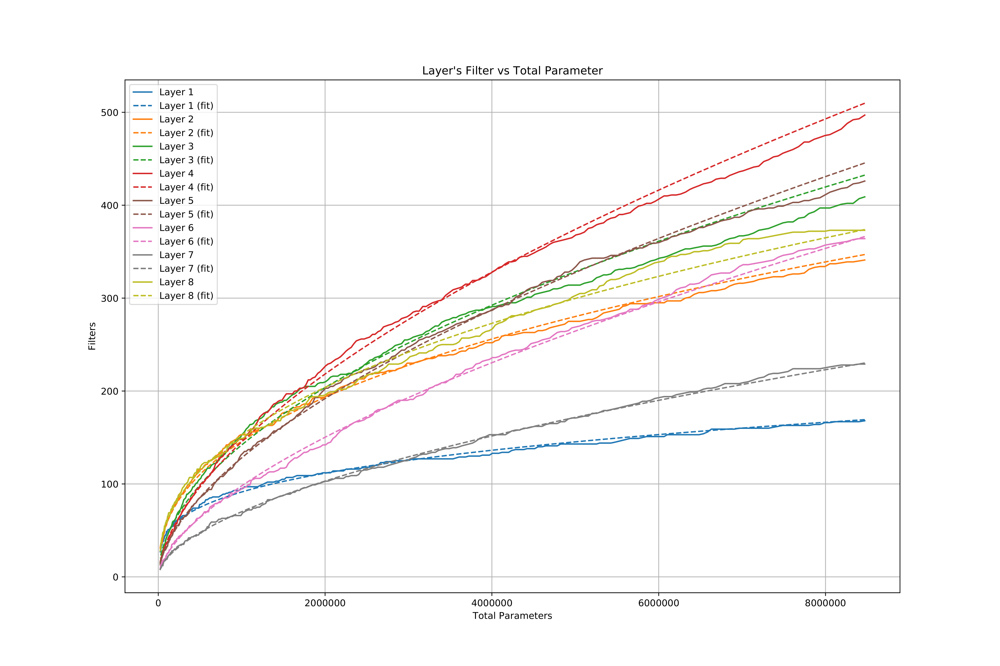</td>
 </tr>
</table>


## Integration to Other Architectures

NeuralScale can be applied to various architecture where the implementation are as follows:
1. Using `model/VGG.py`, `model/mobilenetv2.py` and `model/preact_resnet.py` as an example, the function `prepare_filters()` has to be modified for the targeted architecture
2. Gates are added after batch normaliztion layers (preferably)
3. Modify and Run `architecture_descent.py`
4. Voila! You get your optimized architecture configuration


## Citation
If you find this code useful you can cite us using the following bibTex:
```
@inproceedings{lee2020neuralscale,
  title={NeuralScale: Efficient Scaling of Neurons for Resource-Constrained Deep Neural Networks},
  author={Lee, Eugene and Lee, Chen-Yi},
  booktitle={Proceedings of the IEEE/CVF Conference on Computer Vision and Pattern Recognition},
  pages={1478--1487},
  year={2020}
}
```